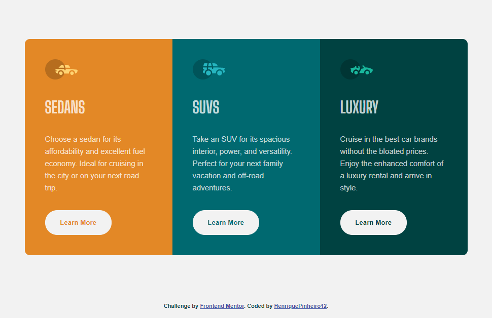

# Frontend Mentor - 3-column preview card component

This is a solution to the [3-column preview card component solution](https://www.frontendmentor.io/challenges/3column-preview-card-component-pH92eAR2-/hub/responsive-card-preview-using-css-grid-eliq7VYeK).

## Table of contents

- [Overview](#overview)
  - [The challenge](#the-challenge)
  - [Screenshot](#screenshot)
  - [Links](#links)
- [My process](#my-process)
  - [Built with](#built-with)
  - [What I learned](#what-i-learned)
  - [Continued development](#continued-development)
- [Author](#author)

## Overview

### The challenge

Users should be able to:

- See hover states for interactive elements

### Screenshot

### Links

- [Solution Link](https://www.frontendmentor.io/solutions/responsive-card-preview-using-css-grid-eliq7VYeK)
- [Live Site Link](https://henriquepinheiro12.github.io/3-column-preview-card-component-main/)

## My process

### Built with

- Semantic HTML5 markup
- CSS custom properties
- CSS Grid
- Mobile-first workflow

### What I learned

- Working with Mobile-first aproach and using css grid layouts

### Continued development

I´m up to continue learning about:

- Semantic HTML5 markup
- hsl colors
- box-shadows
- bacground-images
- background-colors
- using media queries
- CSS vars
- CSS grid

## Author

- Frontend Mentor - [@HenriquePinheiro12](https://www.frontendmentor.io/profile/HenriquePinheiro12)
- Github - [@HenriquePinheiroo12](https://github.com/henriquepinheiro12/)
- Linkedin - [@Henrique Pinheiro](https://www.linkedin.com/in/henrique-pinheiro-a43b62203/)
