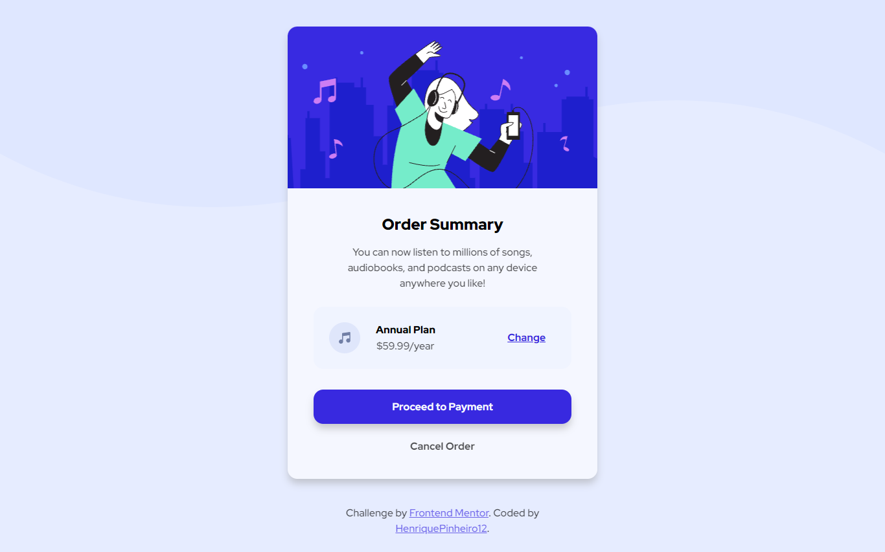

# Frontend Mentor - Order summary card solution

This is a solution to the [Order summary card challenge on Frontend Mentor](https://www.frontendmentor.io/challenges/order-summary-component-QlPmajDUj).


## Table of contents

- [Overview](#overview)
  - [The challenge](#the-challenge)
  - [Screenshot](#screenshot)
  - [Links](#links)
- [My process](#my-process)
  - [Built with](#built-with)
  - [What I learned](#what-i-learned)
  - [Continued development](#continued-development)
  - [Useful resources](#useful-resources)
- [Author](#author)
- [Acknowledgments](#acknowledgments)


## Overview

### The challenge

Users should be able to:

- See hover states for interactive elements

### Screenshot




### Links

- [Solution Link](https://www.frontendmentor.io/solutions/responsive-order-summary-using-flexbox-HKbcdO_k_)
- [Live Site Link](https://henriquepinheiro12.github.io/OrderSummaryComponent_FrontendMentor/)

## My process

### Built with

- Semantic HTML5 markup
- CSS custom properties
- Flexbox
- Desktop-first workflow

### What I learned

#### Background filter effect
For giving a color filter effect in a background image I just used another div over it with a background-color and some opacity using hexadecimal colors.

```html
<main>
  <div class="background-effect"></div>
</main>
```
```css
main{
  background-image:url(images/pattern-background-desktop.svg);
}

.background-effect{
  width:100%;
  height:100%;
  background-color:#e0e8ffd1;
  /*
    After the first 6 characters, by addind 2 more charcaters (in this case, d1)
    you can change it´s opacity (must study it yet). 
  */
}
```

#### Line Height

Height of a text line

```html
<p>Lorem Ipsum</p>
```

```css
p{
  line-height:1.5rem;
}
```

### Continued development

I´m up to continue learning about:

- Semantic HTML5 markup
- hsl colors
- box-shadows
- bacground-images
- background-colors
- using media queries

## Author

- Frontend Mentor - [@HenriquePinheiro12](https://www.frontendmentor.io/profile/HenriquePinheiro12)
- Github - [@HenriquePinheiroo12](https://github.com/henriquepinheiro12/)
- Linkedin - [@Henrique Pinheiro](https://www.linkedin.com/in/henrique-pinheiro-a43b62203/)
