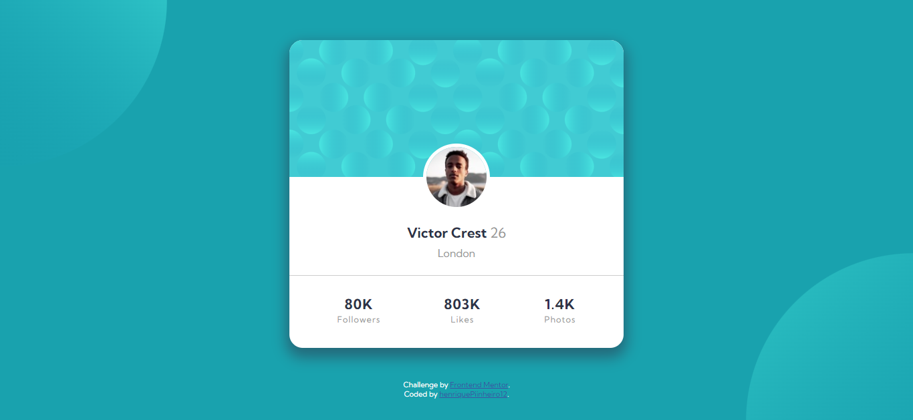
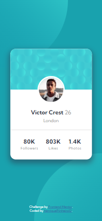

# Frontend Mentor - Profile card component solution

This is a solution to the [Profile card component challenge on Frontend Mentor](https://www.frontendmentor.io/challenges/profile-card-component-cfArpWshJ). Frontend Mentor challenges help you improve your coding skills by building realistic projects. 

## Table of contents

- [Overview](#overview)
  - [The challenge](#the-challenge)
  - [Screenshot](#screenshot)
  - [Links](#links)
- [My process](#my-process)
  - [Built with](#built-with)
  - [What I learned](#what-i-learned)
  - [Continued development](#continued-development)
- [Author](#author)

## Overview

### The challenge

- Build out the project to the designs provided

### Screenshot

### Links

- [Solution URL](https://www.frontendmentor.io/solutions/responsive-profile-card-using-flexbox-ayrT6dfYv)
- [Live Site URL](https://henriquepinheiro12.github.io/profile-card-component-main/)

## My process

### Built with

- Semantic HTML5 markup
- CSS custom properties
- Flexbox
- Mobile-first workflow

### What I learned

- Use position absolute to place dynamic images 
- Working with Mobile-first aproach

### Continued development

I´m up to continue learning about:

- Semantic HTML5 markup
- hsl colors
- box-shadows
- bacground-images
- background-colors
- using media queries
- CSS vars
- CSS grid

## Author

- Frontend Mentor - [@HenriquePinheiro12](https://www.frontendmentor.io/profile/HenriquePinheiro12)
- Github - [@HenriquePinheiroo12](https://github.com/henriquepinheiro12/)
- Linkedin - [@Henrique Pinheiro](https://www.linkedin.com/in/henrique-pinheiro-a43b62203/)
