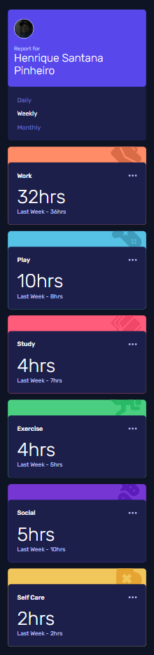

# Frontend Mentor - Time tracking dashboard solution

This is a solution to the [Time tracking dashboard challenge on Frontend Mentor](https://www.frontendmentor.io/challenges/time-tracking-dashboard-UIQ7167Jw).

## Table of contents

- [Overview](#overview)
  - [The challenge](#the-challenge)
  - [Screenshot](#screenshot)
  - [Links](#links)
- [My process](#my-process)
  - [Built with](#built-with)
  - [What I learned](#what-i-learned)
  - [Continued development](#continued-development)
- [Author](#author)

## Overview

### The challenge

Users should be able to:

- View the optimal layout for the site depending on their device's screen size
- See hover states for all interactive elements on the page
- Switch between viewing Daily, Weekly, and Monthly stats

### Screenshot





### Links

- Solution URL: [https://www.frontendmentor.io/solutions/responsive-dashboard-using-grid-nMUxmQXjc](https://www.frontendmentor.io/solutions/responsive-dashboard-using-grid-nMUxmQXjc)
- Live Site URL: [https://henriquepinheiro12.github.io/Time-tracking-dashboard_FrontendMentor/](https://henriquepinheiro12.github.io/Time-tracking-dashboard_FrontendMentor/)

## My process

### Built with

- Semantic HTML5 markup
- CSS custom properties
- Flexbox
- CSS Grid

### What I learned

- Working with local JSON files imported as ES Modules

```js
    import jsonData from './path/data.json' assert {type: 'json'}
```

### Continued development

- I´m interested in start learning about React.js and Next.js now!

## Author 🧑‍💻

- Frontend Mentor - [@HenriquePinheiro12](https://www.frontendmentor.io/profile/HenriquePinheiro12)
- Github - [@HenriquePinheiroo12](https://github.com/henriquepinheiro12/)
- Linkedin - [@Henrique Pinheiro](https://www.linkedin.com/in/henrique-pinheiro-a43b62203/)